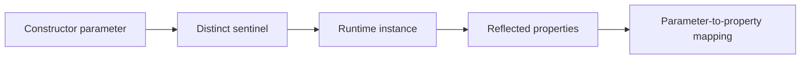

# Runtime Constructor Flow Analysis

A compact reference implementation that discovers how constructor arguments
flow into properties by instantiating a type with distinctive sentinel values
and inspecting the resulting object graph.

## Run the demo

```bash
dotnet run --project src/Demo.ConsoleApp
```

## Core algorithm

For each constructor parameter at index `i`:

1. Create a unique sentinel for that parameter and defaults for the others.
2. Invoke the selected constructor with the resulting argument array.
3. Inspect properties and match the sentinel by reference or value equality.
4. Probe the direct base constructor to detect values passed through `base(...)`.



## Key advantages

- No IL parsing
- Works with compiled assemblies
- Discovers runtime assignments even when parameter and property names differ
- Detects assignments that flow into direct-base properties

## Limitations

- Constructors must be invokable and their side effects will execute.
- Abstract and open generic types cannot be analyzed directly.
- The initial reference implementation selects the constructor with the most parameters.
- Reference-typed parameters, transformed values, and unsupported value shapes need explicit handling.
- Base-flow analysis is limited to the direct base type.

## License

MIT. See [LICENSE](LICENSE).

